# ThinkSpend - Flow Diagrams

Complete visual guide to data flows and architecture using Mermaid diagrams.

---

## Table of Contents

1. [High-Level Architecture](#1-high-level-architecture)
2. [User Authentication Flow](#2-user-authentication-flow)
3. [Note Creation & Editing Flow](#3-note-creation--editing-flow)
4. [Expense Detection Flow](#4-expense-detection-flow)
5. [Cross-Note Discovery Algorithm](#5-cross-note-discovery-algorithm)
6. [Wiki Link Flow](#6-wiki-link-flow)
7. [Auto-Save Mechanism](#7-auto-save-mechanism)
8. [Knowledge Graph Rendering](#8-knowledge-graph-rendering)
9. [Database Schema Relationships](#9-database-schema-relationships)
10. [Component Hierarchy](#10-component-hierarchy)
11. [State Management Flow](#11-state-management-flow)
12. [Complete User Journey](#12-complete-user-journey)

---

## 1. High-Level Architecture


---

## 2. User Authentication Flow


---

## 3. Note Creation & Editing Flow

```mermaid
flowchart TD
    Start([User Opens NotesView]) --> LoadFolders[Load Folders from DB]
    LoadFolders --> SelectFolder{Select Folder}
    SelectFolder --> CreateNote[Click Create Note]
    CreateNote --> InsertDB[(Insert into notes table)]
    InsertDB --> SetCurrent[Set as currentNote]
    SetCurrent --> LoadEditor[Load in TipTap Editor]

    LoadEditor --> UserTypes[User Types Content]
    UserTypes --> ReactiveUpdate[content.value = editor.getHTML()]
    ReactiveUpdate --> ParseExpenses{Parse for Expenses}
    ReactiveUpdate --> ParseLinks{Parse for [[Links]]}

    ParseExpenses --> ShowBadge[Show Expense Count Badge]
    ParseLinks --> HighlightLinks[Highlight Wiki Links]

    UserTypes --> TriggerSave[Trigger Auto-Save]
    TriggerSave --> Debounce{Wait 2 seconds}
    Debounce -->|Still typing| UserTypes
    Debounce -->|No more typing| SaveToDB

    SaveToDB[(Update notes table)] --> ProcessExpenses[Process Detected Expenses]
    SaveToDB --> ProcessLinks[Process Detected Links]

    ProcessExpenses --> CreateExpenseRecords[Create Expense Records]
    CreateExpenseRecords --> RunDiscovery[Run Cross-Note Discovery]
    RunDiscovery --> CreateContextLinks[Create Context Links]

    ProcessLinks --> FindTargetNotes[Find Target Notes by Title]
    FindTargetNotes --> CreateNoteLinks[Create Note Links]

    CreateContextLinks --> UpdateUI[Update Connection Panel]
    CreateNoteLinks --> UpdateUI
    UpdateUI --> Done([Done - UI Refreshed])

    style Start fill:#81A2BE
    style Done fill:#B5BD68
    style RunDiscovery fill:#DE935F
```

---

## 4. Expense Detection Flow

```mermaid
flowchart LR
    subgraph "User Input"
        A["User types:<br/>$25 Lunch [Food]"]
    end

    subgraph "Real-time Detection"
        B[TipTap Editor Update]
        C[watch content fires]
        D[useExpenseParser.parseExpenses]
        E{Regex Match}
    end

    subgraph "Parsing Logic"
        F[Extract: amount = 25]
        G[Extract: description = 'Lunch']
        H[Extract: category = 'Food']
        I{Validate Category}
    end

    subgraph "UI Update"
        J[detectedExpenses.value = [...]]
        K[Show Badge: '1 expense']
        L[Highlight in Editor]
    end

    subgraph "On Save"
        M{Check Duplicates}
        N[Create Expense Record]
        O[Create 'mentioned' Link]
        P[Run Cross-Note Discovery]
    end

    A --> B --> C --> D --> E
    E -->|Match| F & G & H
    F & G & H --> I
    I -->|Valid| J
    I -->|Invalid| Q[Default to 'Other']
    Q --> J
    J --> K & L

    L --> M
    M -->|Not Duplicate| N --> O --> P
    M -->|Duplicate| R[Skip]

    style A fill:#81A2BE
    style P fill:#DE935F
    style K fill:#B5BD68
```

---

## 5. Cross-Note Discovery Algorithm

```mermaid
flowchart TD
    Start([Expense Created]) --> Extract[Extract Search Terms]

    Extract --> Filter{Filter Terms}
    Filter -->|Keep| Length{length >= 3?}
    Filter -->|Remove| StopWords[Stop words: the, and, or...]
    Filter -->|Remove| Numbers[Pure numbers]

    Length -->|Yes| TermsList[Search Terms List]
    Length -->|No| Remove[Remove]

    TermsList --> AddCategory[Add Category to Terms]
    AddCategory --> FetchNotes[(Fetch ALL User Notes)]

    FetchNotes --> LoopNotes{For Each Note}

    LoopNotes --> CalcRelevance[Calculate Relevance Score]

    subgraph "Relevance Scoring"
        CalcRelevance --> CheckTitle{Term in Title?}
        CheckTitle -->|Yes| TitleScore["+2.0 weight"]
        CheckTitle -->|No| CheckContent

        CheckContent{Term in Content?}
        CheckContent -->|Yes| ContentScore["+1.0 weight"]
        CheckContent -->|No| NextTerm

        TitleScore --> CheckCategory
        ContentScore --> CheckCategory
        CheckCategory{Category Match?}
        CheckCategory -->|Yes| CategoryBonus["+1.5 bonus"]
        CheckCategory -->|No| NextTerm
        CategoryBonus --> NextTerm

        NextTerm[Next Search Term]
    end

    NextTerm --> NormalizeScore[Normalize: matched/total terms]
    NormalizeScore --> StoreScore[Store: {note, score}]

    StoreScore --> LoopNotes
    LoopNotes -->|All Done| FilterThreshold{Score >= 0.3?}

    FilterThreshold -->|Yes| SortByScore[Sort by Score DESC]
    FilterThreshold -->|No| Discard[Discard]

    SortByScore --> TakeTop5[Take Top 5]

    TakeTop5 --> CreateLinks{For Each Relevant Note}
    CreateLinks --> InsertLink[(Insert note_expense_link)]
    InsertLink --> SetType["link_type = 'context'"]
    SetType --> SetStrength["strength = score"]
    SetStrength --> LogResult[Log: Created link]

    LogResult --> CreateLinks
    CreateLinks -->|All Done| Return([Return Links Array])

    style Start fill:#81A2BE
    style Return fill:#B5BD68
    style CalcRelevance fill:#DE935F
    style InsertLink fill:#B294BB
```

---

## 6. Wiki Link Flow


---

## 7. Auto-Save Mechanism

```mermaid
stateDiagram-v2
    [*] --> Idle

    Idle --> Typing: User types
    Typing --> Debouncing: Trigger save
    Debouncing --> Typing: User types again (reset timer)
    Debouncing --> Saving: 2 seconds elapsed

    Saving --> UpdatingDB: Update notes table
    UpdatingDB --> ProcessingExpenses: Process expenses
    ProcessingExpenses --> ProcessingLinks: Process links
    ProcessingLinks --> Saved: All complete

    Saved --> Idle: Wait for next change

    UpdatingDB --> Error: Database error
    Error --> Idle: Show error status

    note right of Debouncing
        Timer: 2000ms
        Prevents spam
    end note

    note right of ProcessingExpenses
        1. Check duplicates
        2. Create expense records
        3. Run discovery algorithm
    end note

    note right of Saved
        Status indicator:
        "Saved ✓"
    end note
```



---

## 8. Knowledge Graph Rendering

```mermaid
flowchart TD
    Start([User Clicks 'Knowledge Graph']) --> FetchData{Fetch Data}

    FetchData --> FetchNotes[(Get all notes)]
    FetchData --> FetchExpenses[(Get all expenses)]
    FetchData --> FetchLinks[(Get all links)]

    FetchNotes --> BuildNodes[Build Nodes Array]
    FetchExpenses --> BuildNodes

    BuildNodes --> NodeType{Node Type}
    NodeType -->|Note| NoteNode["{ id, type: 'note', color: blue }"]
    NodeType -->|Expense| ExpenseNode["{ id, type: 'expense', color: green }"]

    NoteNode --> Nodes[nodes[]]
    ExpenseNode --> Nodes

    FetchLinks --> BuildEdges[Build Edges Array]
    BuildEdges --> EdgeType{Link Type}
    EdgeType -->|mentioned| Strong["{ source, target, strength: 1.0 }"]
    EdgeType -->|context| Weak["{ source, target, strength: 0.3-0.7 }"]

    Strong --> Edges[edges[]]
    Weak --> Edges

    Nodes --> InitD3[Initialize D3 Simulation]
    Edges --> InitD3

    InitD3 --> Forces[Configure Forces]
    Forces --> LinkForce[Link Force: distance=100]
    Forces --> ChargeForce[Charge Force: strength=-300]
    Forces --> CenterForce[Center Force: center of canvas]
    Forces --> CollisionForce[Collision Force: radius=30]

    LinkForce --> RunSimulation[Start Simulation]
    ChargeForce --> RunSimulation
    CenterForce --> RunSimulation
    CollisionForce --> RunSimulation

    RunSimulation --> Tick{On Each Tick}
    Tick --> UpdatePositions[Update Node/Edge Positions]
    UpdatePositions --> Render[Render SVG]
    Render --> Stable{Simulation Stable?}

    Stable -->|No| Tick
    Stable -->|Yes| Interactive[Enable Interactions]

    Interactive --> Drag[Drag nodes]
    Interactive --> Click[Click to navigate]
    Interactive --> Zoom[Zoom & pan]

    Drag --> Done([Graph Ready])
    Click --> Done
    Zoom --> Done

    style Start fill:#81A2BE
    style Done fill:#B5BD68
    style InitD3 fill:#DE935F
```

---

## 9. Database Schema Relationships


---

## 10. Component Hierarchy


---

## 11. State Management Flow


---

## 12. Complete User Journey


---

## 13. Expense Detection - Detailed Flow

```mermaid
flowchart TD
    Start([User Types in Editor]) --> Input["Input: $25 Lunch [Food]"]

    Input --> EditorUpdate[TipTap onUpdate Event]
    EditorUpdate --> SetContent["content.value = editor.getHTML()"]

    SetContent --> Watcher{watch content fires}
    Watcher --> CallParser[parseExpenses(content)]

    subgraph "useExpenseParser.js"
        CallParser --> StripHTML[Strip HTML Tags]
        StripHTML --> Regex[Apply Regex Pattern]

        Regex --> Pattern["Pattern: /\$(\d+(?:\.\d{1,2})?)\s+([^\[\n$]+?)\s*\[([^\]]+)\]/g"]

        Pattern --> Loop{For Each Match}

        Loop --> ExtractAmount[amount = parseFloat match[1]]
        Loop --> ExtractDesc[description = match[2].trim]
        Loop --> ExtractCat[category = match[3].trim]

        ExtractAmount --> Validate{Validate}
        ExtractDesc --> Validate
        ExtractCat --> Validate

        Validate -->|amount > 0| CheckCategory
        Validate -->|amount <= 0| Skip1[Skip]

        CheckCategory{Category Valid?}
        CheckCategory -->|Yes| CreateObj
        CheckCategory -->|No| DefaultOther["category = 'Other'"]
        DefaultOther --> CreateObj

        CreateObj[Create Expense Object]
        CreateObj --> AddToArray["expenses.push({amount, description, category})"]

        AddToArray --> Loop
        Loop -->|Done| Return[Return expenses[]]
    end

    Return --> UpdateReactive["detectedExpenses.value = expenses"]
    UpdateReactive --> UpdateBadge["Show badge: '1 expense'"]

    UpdateReactive --> WatchSave{watch [title, content]}
    WatchSave --> TriggerAS[triggerSave]
    TriggerAS --> Debounce[2 second debounce]

    Debounce --> SaveNote[Save Note to DB]
    SaveNote --> ProcessExp[processDetectedExpenses]

    subgraph "processDetectedExpenses"
        ProcessExp --> CheckDup{Check Duplicates}
        CheckDup -->|Not Duplicate| CreateExp[createExpense]
        CheckDup -->|Duplicate| Skip2[Skip]

        CreateExp --> InsertExpDB[(INSERT INTO expenses)]
        InsertExpDB --> CreateLink[createNoteExpenseLink]
        CreateLink --> InsertLinkDB[("INSERT INTO note_expense_links<br/>link_type='mentioned'<br/>strength=1.0")]

        InsertLinkDB --> Discovery[discoverRelatedNotes]
        Discovery --> Algorithm[Cross-Note Discovery Algorithm]
        Algorithm --> ContextLinks[Create Context Links]
    end

    ContextLinks --> Done([Done])

    style Input fill:#81A2BE
    style Algorithm fill:#DE935F
    style Done fill:#B5BD68
    style InsertExpDB fill:#B294BB
```

---

## 14. Cross-Note Discovery - Performance Analysis


---

## 15. React Event Flow


---

## 16. Error Handling Flow

```mermaid
flowchart TD
    Start([User Action]) --> Try{Try Block}

    Try --> AsyncOp[Async Operation]
    AsyncOp --> Supabase[Supabase Query]

    Supabase --> Check{Check Error}

    Check -->|No Error| Success[Process Data]
    Success --> UpdateState[Update Store State]
    UpdateState --> UISuccess[Show Success UI]
    UISuccess --> Done1([Done])

    Check -->|Error| CatchBlock[Catch Block]
    CatchBlock --> LogError["console.error(error)"]
    LogError --> CheckType{Error Type}

    CheckType -->|Duplicate Key 23505| SkipDup[Skip - Already Exists]
    CheckType -->|Auth Error| RedirectLogin[Redirect to /login]
    CheckType -->|Network Error| ShowRetry[Show Retry Button]
    CheckType -->|Other| ShowError[Show Error Message]

    SkipDup --> UIWarning[Show Warning Toast]
    RedirectLogin --> Router[router.push('/login')]
    ShowRetry --> RetryButton[User Clicks Retry]
    ShowError --> ErrorState[Set error.value]

    UIWarning --> Done2([Done])
    Router --> Done2
    RetryButton --> Start
    ErrorState --> UIError[Display Error in UI]
    UIError --> Done2

    style Success fill:#B5BD68
    style CatchBlock fill:#CC6666
    style Done1 fill:#81A2BE
    style Done2 fill:#81A2BE
```

---

## 17. Wiki Link Detection & Navigation


---

## How to Use These Diagrams

### In GitHub README.md:

```markdown
# ThinkSpend Architecture

## System Overview

```

### Render on GitHub:
- GitHub automatically renders Mermaid diagrams
- Works in README.md, wiki pages, issues, PR descriptions
- No images needed - pure markdown!

### Export as Images:
1. Visit: https://mermaid.live/
2. Paste Mermaid code
3. Click "Export" → PNG/SVG
4. Use in presentations, reports

### Interactive Diagrams:
Add to your docs with Mermaid CLI:
```bash
npm install -g @mermaid-js/mermaid-cli
mmdc -i FLOWCHARTS.md -o flowcharts.pdf
```

---

## Legend

**Colors:**
- 🔵 Blue (#81A2BE) - Entry points, user actions
- 🟢 Green (#B5BD68) - Success states, completion
- 🟠 Orange (#DE935F) - Core algorithms, important processes
- 🟣 Purple (#B294BB) - Database operations
- 🔴 Red (#CC6666) - Errors, warnings

**Shapes:**
- Rectangle - Process/Action
- Diamond - Decision
- Circle - Start/End
- Cylinder - Database
- Parallelogram - Input/Output

---

**Created:** 2025-10-18
**For:** ThinkSpend Project Documentation
**Purpose:** Visual guide for developers, stakeholders, and academic reports
