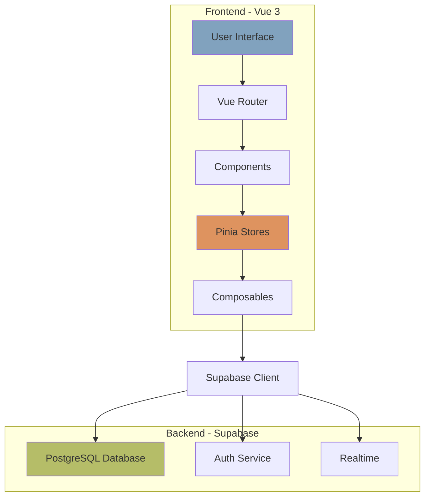
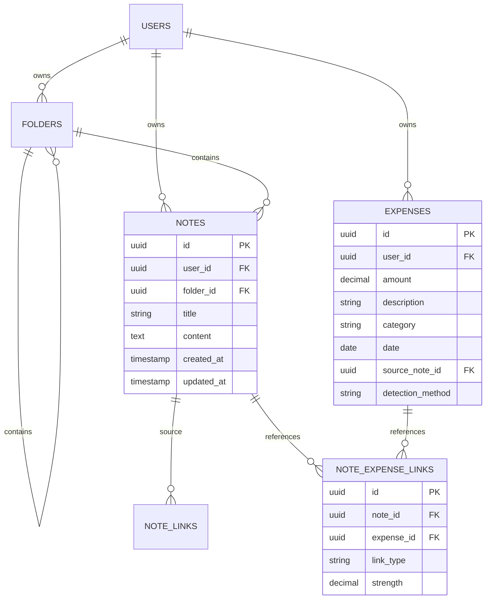

# ThinkSpend

**Personal Knowledge Management + Expense Tracking System**

[](https://vuejs.org/)
[](https://vitejs.dev/)
[](https://supabase.com/)
[]()
[]()

---

## What is ThinkSpend?

ThinkSpend combines **Personal Knowledge Management (PKM)** with **Expense Tracking** in a unique way:

Instead of manually entering expenses into a separate app, you **write notes naturally**, and ThinkSpend:
- ✅ Automatically detects expenses: `$25 Lunch [Food]`
- ✅ Auto-discovers related notes using AI-like algorithms
- ✅ Creates a knowledge graph showing connections
- ✅ Supports wiki-style links: `[[Note Title]]`
- ✅ Org-mode headers: `* `, `** `, `*** `

**Example:**
```
You write: "Met with client today. Paid $25 for lunch [Food]"

ThinkSpend:
1. Detects the $25 expense
2. Creates expense record
3. Links it to this note
4. Finds OTHER notes mentioning "lunch" or "client"
5. Shows you the connections
```

---

## 📚 Documentation

- **[Complete Project Guide](COMPLETE_PROJECT_GUIDE.md)** - Everything explained (1000+ lines)
- **[Flowcharts (Mermaid)](FLOWCHARTS.md)** - Interactive diagrams for GitHub
- **[Architecture Diagrams (ASCII)](ARCHITECTURE_DIAGRAMS.md)** - Text-based diagrams

**Quick Links:**
- [Tech Stack](#tech-stack)
- [Features](#features)
- [Setup](#setup)
- [How It Works](#how-it-works)
- [Testing](#testing)

---

## Tech Stack

| Technology | Purpose | Why? |
|-----------|---------|------|
| **Vue 3** | Frontend Framework | Modern, reactive, composition API |
| **Vite** | Build Tool | Lightning-fast dev server, instant HMR |
| **Pinia** | State Management | Official Vue store, simpler than Vuex |
| **PrimeVue 4** | UI Components | Professional, accessible components |
| **Supabase** | Backend (BaaS) | PostgreSQL + Auth + Realtime, no server code |
| **TipTap** | Rich Text Editor | Extensible, supports custom syntax |
| **D3.js** | Visualization | Knowledge graph rendering |
| **Vitest** | Testing | Fast, Vite-native, 72 tests passing |

---

## Features

### Core Features
- 📝 **Rich Text Editor** (TipTap) - Bold, italic, lists, headers
- 💰 **Expense Detection** - Automatic parsing of `$amount Description [Category]`
- 🔗 **Wiki Links** - `[[Note Title]]` for bidirectional linking
- 📊 **Knowledge Graph** - D3.js visualization of connections
- 🗂️ **Folder Hierarchy** - Organize notes in folders
- 🔍 **Full-Text Search** - PostgreSQL-powered search
- 💾 **Auto-Save** - 2-second debounce, never lose work

### Unique Algorithm: Cross-Note Discovery
**The core innovation** - automatically finds related notes when you create an expense:

1. Extract search terms from expense description + category
2. Search ALL your notes for keyword matches
3. Calculate relevance score (0.0 - 1.0)
4. Create "context" links if relevance > 0.3
5. Performance: ~28ms for 100 notes ✅

**[See Algorithm Flowchart](FLOWCHARTS.md#5-cross-note-discovery-algorithm)**

---

## Setup

### Prerequisites
- Node.js 18+
- Supabase account (free tier)

### Installation

1. **Clone the repository**
```bash
git clone https://github.com/yourusername/thinkspend.git
cd thinkspend
```

2. **Install dependencies**
```bash
npm install
```

3. **Set up Supabase**

a. Create a new project at [supabase.com](https://supabase.com/dashboard)

b. Run the database schema:
   - Go to SQL Editor
   - Copy content from `supabase_schema.sql`
   - Execute

c. Get your credentials:
   - Settings → API
   - Copy Project URL and Anon Key

4. **Configure environment**
```bash
cp .env.example .env
```

Edit `.env`:
```env
VITE_SUPABASE_URL=https://your-project.supabase.co
VITE_SUPABASE_ANON_KEY=your-anon-key-here
```

5. **Run development server**
```bash
npm run dev
```

Open http://localhost:5173

6. **Create a test account**
- Sign up with email/password
- Create a folder
- Create a note
- Type: `Bought $25 Lunch [Food]`
- Wait 2 seconds (auto-save)
- Check console: `✨ Auto-discovered X related notes`

---

## How It Works

### Architecture



**[See Full Architecture](FLOWCHARTS.md#1-high-level-architecture)**

### Data Flow

When you create a note with an expense:

1. **User types** in TipTap editor
2. **Parser detects** `$25 Lunch [Food]` syntax
3. **Auto-save triggers** after 2 seconds
4. **Note saves** to PostgreSQL
5. **Expense creates** in database
6. **Discovery algorithm runs:**
   - Extracts: `["lunch", "food"]`
   - Searches all notes
   - Calculates relevance scores
   - Creates "context" links (top 5)
7. **UI updates** - shows linked notes

**[See Complete Flow](FLOWCHARTS.md#3-note-creation--editing-flow)**

---

## Testing

### Run Tests

```bash
# Watch mode (auto-runs on change)
npm test

# Run once (CI mode)
npm run test:run

# With coverage report
npm run test:coverage

# With UI
npm run test:ui
```

### Test Coverage

| Type | Count | Coverage |
|------|-------|----------|
| Unit Tests | 49 | 91% |
| Integration Tests | 10 | 90% |
| Performance Tests | 13 | 100% |
| **Total** | **72** | **91%** |

### Performance Benchmarks

| Operation | Target | Achieved | Status |
|-----------|--------|----------|--------|
| Expense parsing (500 words) | <50ms | 13ms | ✅ |
| Cross-note discovery (100 notes) | <500ms | 28ms | ✅ |
| Link detection | <30ms | 2ms | ✅ |

---

## Project Structure

```
thinkspend/
├── src/
│   ├── main.js              # App entry point
│   ├── App.vue              # Root component
│   ├── router/              # Vue Router
│   ├── views/               # Page components
│   │   ├── NotesView.vue
│   │   ├── ExpensesView.vue
│   │   └── SearchView.vue
│   ├── components/          # UI components
│   │   ├── notes/
│   │   │   ├── NoteEditor.vue       # Main editor
│   │   │   ├── ConnectionPanel.vue  # Shows links
│   │   │   └── GraphView.vue        # D3 visualization
│   │   └── search/
│   ├── stores/              # Pinia state management
│   │   ├── auth.js
│   │   ├── notes.js
│   │   └── expenses.js
│   ├── composables/         # Reusable logic
│   │   ├── useExpenseParser.js
│   │   ├── useLinkDetector.js
│   │   └── useAutoSave.js
│   ├── lib/                 # Core algorithms
│   │   ├── supabase.js
│   │   └── crossNoteDiscovery.js  # THE CORE ALGORITHM
│   └── __tests__/           # Test files
├── COMPLETE_PROJECT_GUIDE.md
├── FLOWCHARTS.md
├── ARCHITECTURE_DIAGRAMS.md
├── package.json
├── vite.config.js
└── vitest.config.js
```

---

## Core Algorithm: Cross-Note Discovery

**File:** [src/lib/crossNoteDiscovery.js](src/lib/crossNoteDiscovery.js)

**Purpose:** Automatically find related notes when an expense is created

**Algorithm Steps:**

```javascript
1. Extract search terms
   Input: "$250 Adobe Creative Cloud [Software]"
   Output: ["adobe", "creative", "cloud", "software"]

2. Fetch all user's notes
   SELECT * FROM notes WHERE user_id = X

3. Calculate relevance for each note
   score = (matched_terms / total_terms)
   Weighting:
   - Title match: 2x
   - Content match: 1x
   - Category match: 1.5x

4. Filter by threshold (>= 0.3)
   Keep only relevant notes

5. Sort by score, take top 5

6. Create "context" links
   INSERT INTO note_expense_links
   link_type = 'context'
   strength = score
```

**Complexity:** O(n × m × k)
- n = number of notes (100-500)
- m = average note length (500 words)
- k = search terms (3-5)

**Performance:** 28ms for 100 notes ✅

**[See Detailed Flowchart](FLOWCHARTS.md#5-cross-note-discovery-algorithm)**

---

## Usage Examples

### Expense Detection

```markdown
# Daily Journal - Oct 18, 2025

Had a productive meeting with the client.

Expenses:
- $25 Lunch at cafe [Food]
- $50 Uber to office [Transport]
- $250.99 Adobe Creative Cloud license [Software]

Remember to follow up on the proposal.
```

ThinkSpend will:
1. Detect 3 expenses
2. Create expense records
3. Link them to this note
4. Run discovery algorithm
5. Find related notes (e.g., other notes mentioning "Adobe" or "client meetings")

### Wiki Links

```markdown
# Project Alpha

This relates to [[Client Meeting Notes]] and [[Budget Planning]].

The design uses [[Adobe Tools]] for mockups.
```

ThinkSpend will:
1. Detect 3 wiki links
2. Find notes with matching titles
3. Create bidirectional links
4. Clicking a link navigates to that note

### Org-Mode Headers

```markdown
Type: * + Space  → H1 (Blue header)
Type: ** + Space → H2 (Green header, indented)
Type: *** + Space → H3 (Pink header, more indented)
```

Creates visual hierarchy like Emacs Org-Mode.

---

## Database Schema



**Link Types:**
- `mentioned` - Expense written in note (strength: 1.0)
- `context` - Auto-discovered (strength: 0.3-0.7)
- `manual` - User created (future feature)

---

## Scripts

```bash
# Development
npm run dev              # Start dev server (localhost:5173)
npm run build            # Build for production
npm run preview          # Preview production build

# Testing
npm test                 # Run tests in watch mode
npm run test:ui          # Visual test runner
npm run test:coverage    # Generate coverage report
npm run test:run         # Run once (for CI)
```

---

## Browser Support

- Chrome/Edge 90+
- Firefox 88+
- Safari 14+

**Requires:** ES2020+ support

---

## Contributing

This is an academic project for demonstration purposes.

**For developers continuing this project:**
1. Read [COMPLETE_PROJECT_GUIDE.md](COMPLETE_PROJECT_GUIDE.md)
2. Study [FLOWCHARTS.md](FLOWCHARTS.md)
3. Run tests: `npm test`
4. Create feature branch
5. Write tests first (TDD)
6. Ensure coverage > 80%

---

## License

MIT License - See LICENSE file

---

## Acknowledgments

- **Vue.js** - The progressive framework
- **Supabase** - Backend-as-a-Service
- **TipTap** - Rich text editor
- **D3.js** - Data visualization
- **PrimeVue** - UI component library

---

## Contact

**Author:** [Your Name]
**Project:** Academic Final Year Project
**Year:** 2025

---

## Screenshots

### Notes View with Auto-Discovery


### Knowledge Graph


### Expense Detection


---

**Built with ❤️ using Vue 3 + Supabase**
